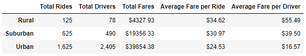
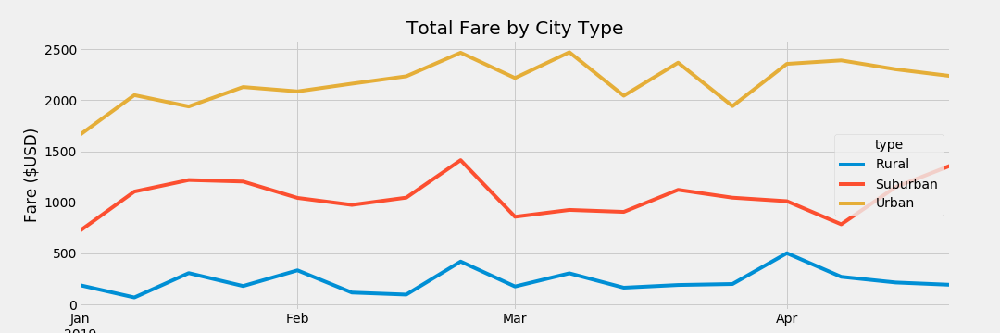

# PyBer Analysis
## Overview of Project
### Purpose
The purpose of this project is to summarize and analyze how total weekly fares differ in the three city types (Rural, Suburban, Urban).
### Overview
A summary DataFrame with the total rides, total drivers, total fares, and averages of fares per ride and per driver were created. To do this, the city and the ride data csv files were merged into a single dataset. From there, the total rides was calculated using `groupby().count()` while the driver cound and total fares used `groupby().sum()`.
  
To show trends in the total weekly fares of each city type, a line graph was created with the total weekly fares with each of the city types from 1/1/2019-4/29/2019. The date, fare, and city type was pulled into a new DataFrame and `pivot()` was used to seperate the city types into differnt columns grouped by the date. To pull only the specified dates, `loc()` was used, and a new DataFrame that contained the weekly fare sums was created  using `resample('W').sum()`. This weekly fares DataFram was used to create the line graph using the object-oriented method.
## Results
### Pyber Ride Data Summary

  
Urban cities account for 68% of the total rides and are the only cities where the number of total drivers exceeds the total number of rides. Urban cities also have the lowest average fare per ride and average fare per driver. Drivers in Rural cities get the highest fares but significantly less total rides.

### Total Weekly Fares by City Type from 1/1/2019 to 4/29/2019

  
## Summary
### Business Recomendations
1. Outreach in Rural cities and promotial discounted fares to gain popularity.
2. Increase fares in Urban cities.
3. Increase the number of drivers in suburban and rural cities.

